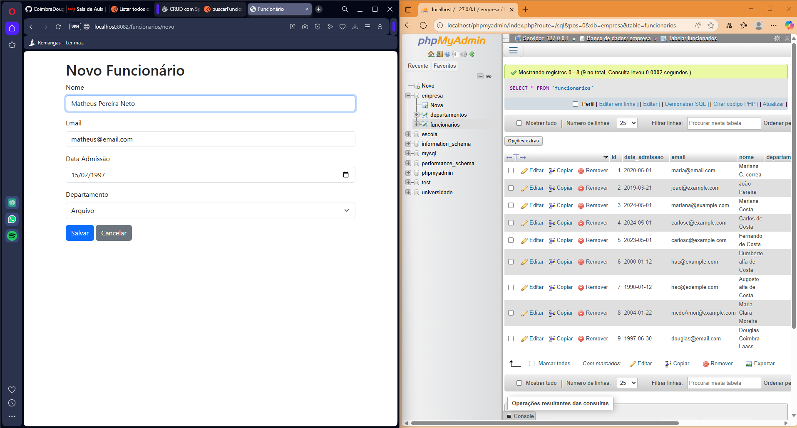
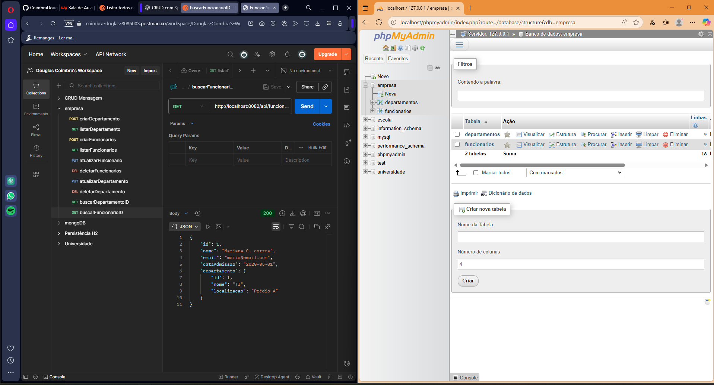

AV1 — Sistema Monolítico: Funcionários & Departamentos

## 📖 Descrição
Este projeto é uma **aplicação monolítica** desenvolvida em **Spring Boot**, que oferece uma solução completa para o gerenciamento de Funcionários e Departamentos.

Professor: 	Leonardo Vieira Guimarães - Disciplina: Arquitetura de Aplicacoes Web - Curso: Análise e Desenvolvimento de Sistemas - Aluno: Douglas Coimbra Laass

Incluindo:

- **API RESTful** para CRUD completo (Create, Read, Update, Delete)  
- **Interface web** com **Thymeleaf** para manipulação visual  
- **Persistência em banco de dados**: MariaDB para produção e H2 para testes  
- Suporte a múltiplos perfis de execução (**test / production**)

---

## 🛠 Tecnologias Utilizadas
- **Java 17+**
- **Spring Boot**
- **Spring Web**
- **Spring Data JPA**
- **Thymeleaf**
- **Lombok**
- **MariaDB**
- **H2 Database**
- **Maven**

---

## 🚀 Estrutura do Projeto
O sistema é composto por:
- **Model** — entidades `Funcionario` e `Departamento`
- **Repository** — acesso a dados com JPA
- **Service** — lógica de negócio
- **Controller** — endpoints REST e páginas Thymeleaf
- **Templates Thymeleaf** — views HTML
- **Configurações** — diferentes profiles (`application.properties` e `application-test.properties`)

---

## 🏃 Como Rodar Localmente

### 🔹 Ambiente de Teste (H2 Database)
Ideal para desenvolvimento e provas, sem necessidade de instalar banco externo.

1. Rodar no terminal:
```bash
mvn clean package
mvn spring-boot:run -Dspring-boot.run.arguments="--spring.profiles.active=test"
```
2. Acessar:

Interface Web: http://localhost:8082/departamentos / http://localhost:8082/funcionarios

Console H2: http://localhost:8082/h2-console

JDBC URL: jdbc:h2:mem:testdb

🔹 Ambiente de Produção Local (MariaDB)
Para execução com banco real.

Criar banco no MariaDB:


Pode usar o comando sql a baixo ou criar manualmente

```bash
CREATE DATABASE empresa CHARACTER SET utf8mb4 COLLATE utf8mb4_unicode_ci;
```
Ajustar src/main/resources/application.properties:

properties
```bash
spring.datasource.url=jdbc:mariadb://localhost:3306/empresa
spring.datasource.username=SEU_USUARIO
spring.datasource.password=SUA_SENHA
spring.jpa.hibernate.ddl-auto=update
```

Rodar:

```bash
Copiar código
mvn clean package
mvn spring-boot:run
```

Acessar:

Interface Web: http://localhost:8081/departamentos / http://localhost:8081/funcionarios

API REST: http://localhost:8081/api/departamentos / http://localhost:8081/api/funcionarios

🔌 Endpoints da API REST
Departamentos
Método	Endpoint	Descrição
```bash
POST	/api/departamentos	Criar novo departamento
GET	/api/departamentos	Listar todos
GET	/api/departamentos/{id}	Buscar por ID
PUT	/api/departamentos/{id}	Atualizar
DELETE	/api/departamentos/{id}	Excluir
```

Funcionários
Método	Endpoint	Descrição
```bash
POST	/api/funcionarios	Criar novo funcionário
GET	/api/funcionarios	Listar todos
GET	/api/funcionarios/{id}	Buscar por ID
PUT	/api/funcionarios/{id}	Atualizar
DELETE	/api/funcionarios/{id}	Excluir
```

🖥 Interface Web (Thymeleaf)
Rota	Função
```bash
/departamentos	Listagem e ações sobre departamentos
/departamentos/novo	Criar novo departamento
/departamentos/{id}/editar	Editar departamento
/funcionarios	Listagem de funcionários
/funcionarios/novo	Criar funcionário com dropdown de departamentos
/funcionarios/{id}/editar	Editar funcionário
```

📸 Projeto em execução
Segue algumas telas do sistema em execução:

01. Tela de visualização dos Departamentos e Banco de Dados


02. Tela de inserção dos Funcionários e Banco de Dados


03.Tela de comandos no Postman e Banco de Dados



📂 Estrutura do Repositório
```bash
Copiar código
av1-empresa/
│
├── src/
│   ├── main/
│   │   ├── java/           # Código Java
│   │   ├── resources/      # Configurações e templates
│   │   └── static/         # Arquivos estáticos (CSS, JS, imagens)
│   │
│   └── test/               # Testes automatizados
│
├── .gitignore
├── pom.xml
└── README.md
```

📚 Referências
Documentação Spring Boot

Thymeleaf Documentation

MariaDB Documentation

H2 Database Documentation
